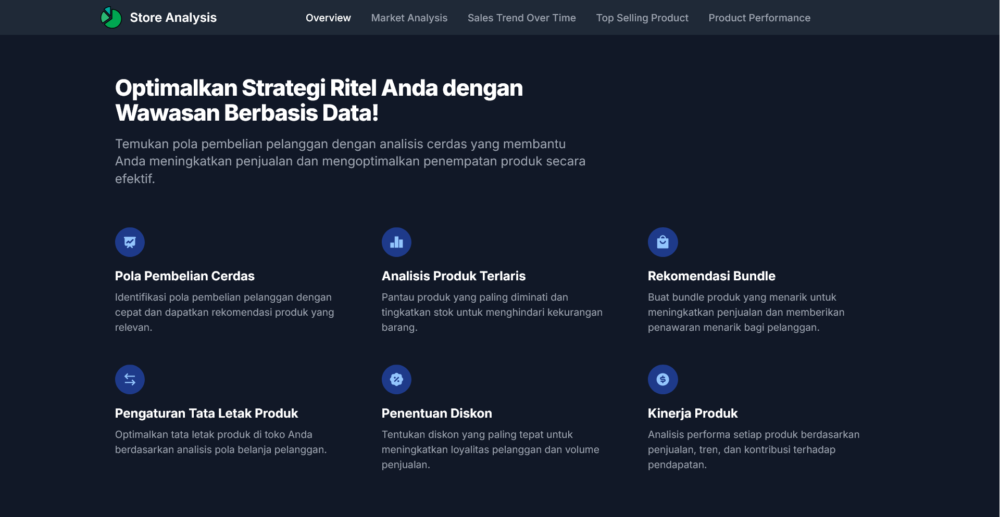
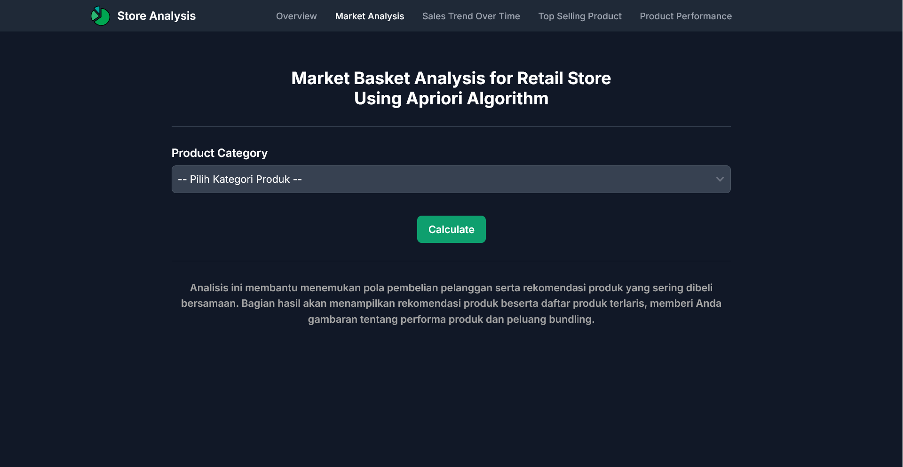
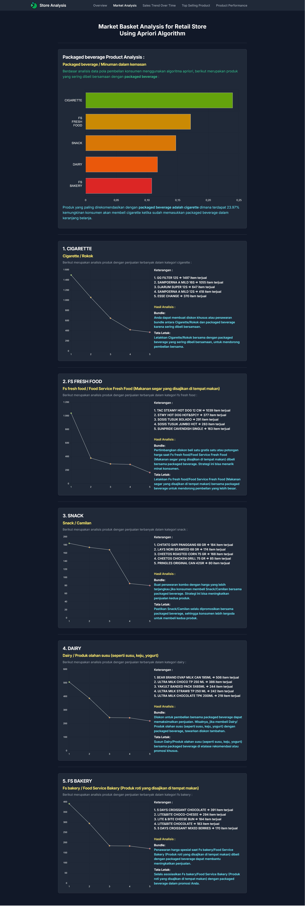
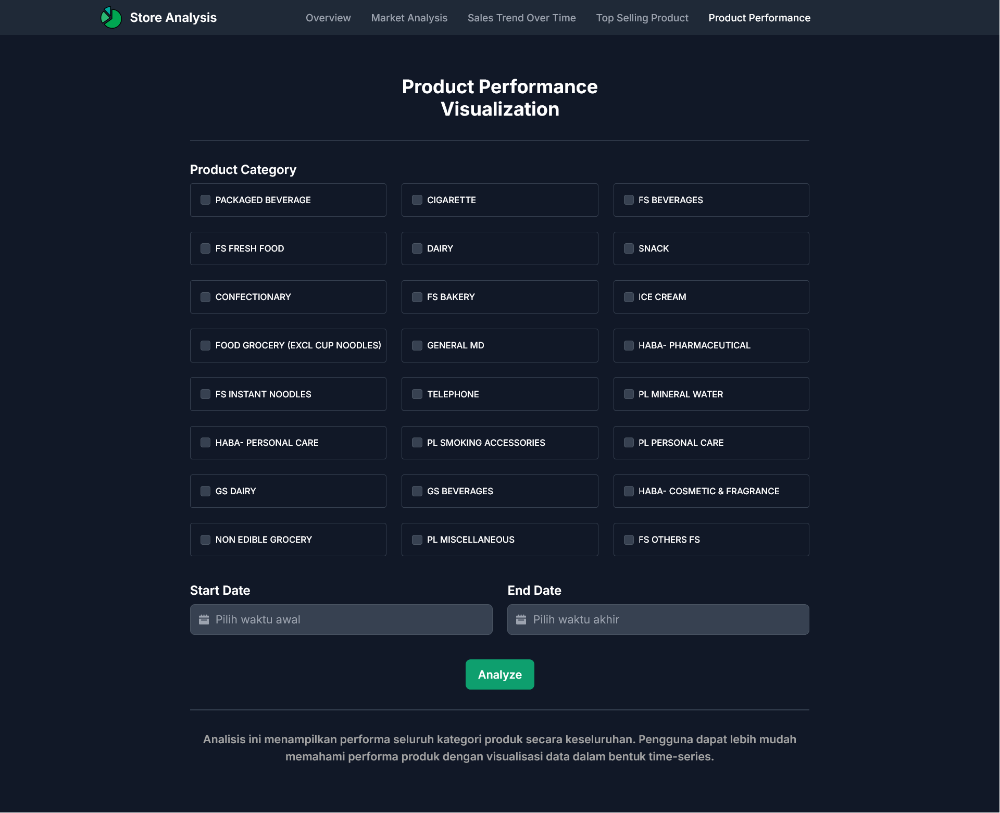
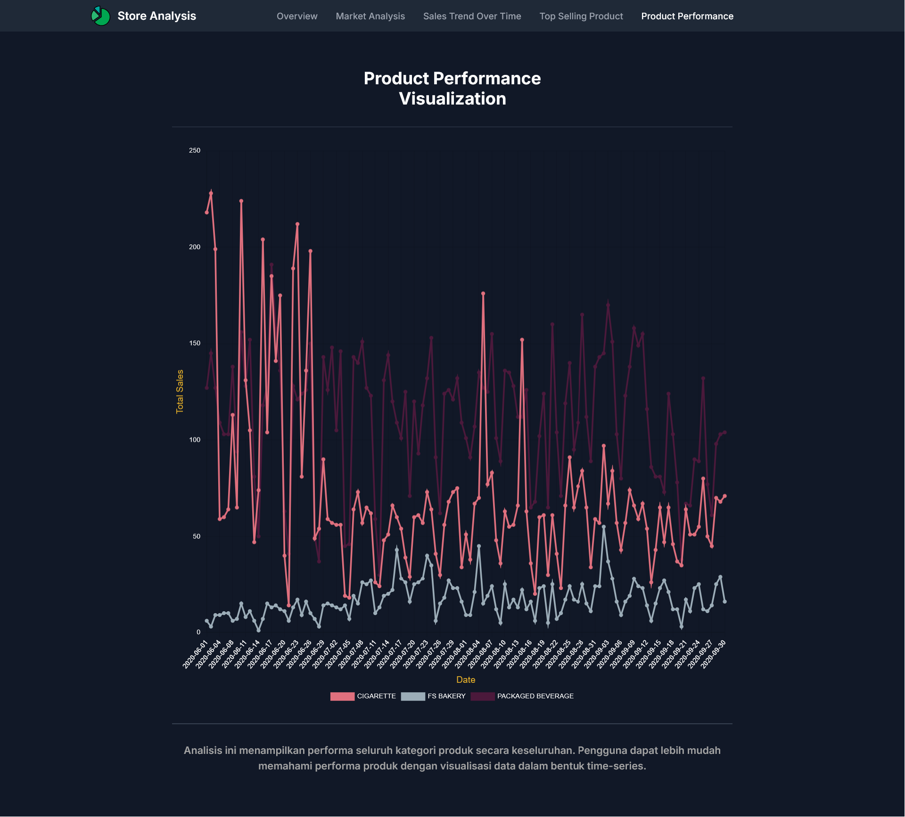
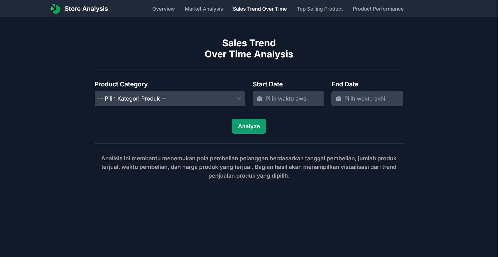
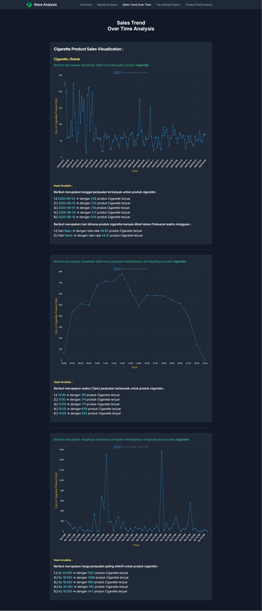
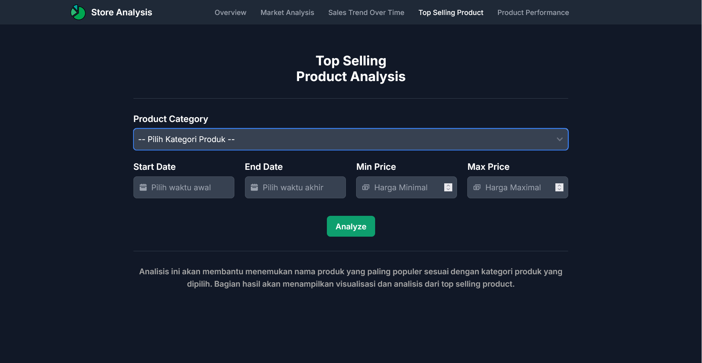
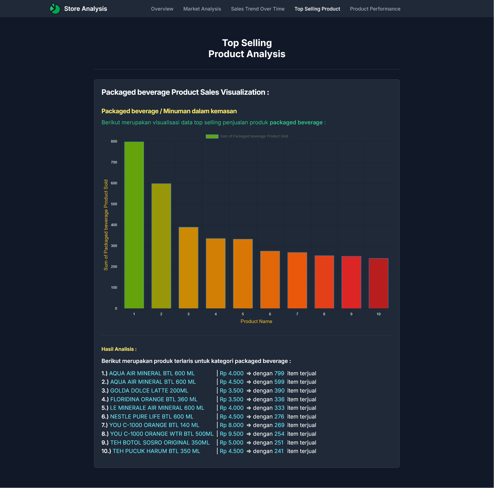

# Market Basket Analysis App

**Market Basket Analysis App** is a web application built to perform **market basket analysis** and visualize sales performance using historical retail sales data.  
The dataset is adapted from Kaggle: [Market Basket Analysis Dataset](https://www.kaggle.com/datasets/trysuharso/market-basket-analysis).

---

## ✨ Features

-   **Market Basket Analysis** – Identify relationships between products frequently bought together.
-   **Sales Trend Over Time Analysis** – Visualize product sales trends by date, time, and sales price.
-   **Top-Selling Product Analysis** – Analyze and visualize products with the highest sales.
-   **Product Performance Visualization** – Compare product performance across time and quantity metrics.

---

## 🛠 Tech Stack

  
  
  
  
  
  
  
  

---

## 📸 Screenshots

-   Dashboard  
    
-   Market Analysis  
    
-   Market Analysis Result  
    
-   Product Performance  
    
-   Product Performance Result  
    
-   Sales Trend Over Time  
    
-   Sales Trend Result  
    
-   Top-Selling Product  
    
-   Top-Selling Product Result  
    
